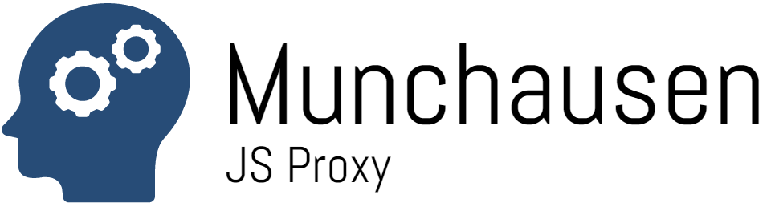

munchausen
==========



JS Proxy utility library to expose an object's attribute as a fallback data source.

API
---

### Usage

```javascript
const proxy = require('munchausen')

module.exports = exports = proxy(exports, '_data')

exports._data = {
  a: 1,
  b: 2
}

exports.log = function (...args) {
  console.log(...args)
}
```

```javascript
const mymodule = require('mymodule')

mymodule.log('works fine')
mymodule.a // 1
```

This can be useful whenever you are creating a module that will have a certain set
of API, but will also need to act as a data source.

About the name of this project
------------------------------

Munchausen and Munchausen by Proxy syndroms are serious psychiatric conditions;
I do not wish, by the somewhat humorous reference made by this project's
name, belittle this fact.

The actual source of inspiration was the band of Von Iva and
Zooey Deschanel as featured in the movie "Yes Man":

[](https://www.youtube.com/watch?v=z6Q6YwOvDy4)

Hope you enjoy their songs.


License
-------

MIT
